# KP 2.1m Slew and Pointing Performance — June 2023

Date: 2026-03-16
Source: rtel server logs from `/archive2/scratch/Sells/tcs/Data/`
Tool: `rteldigest.py` + custom matplotlib analysis

## Dataset

Three productive observing nights from June 2023 — the last month
with multiple full sessions before the telescope entered its decline
phase (Aug 2023: last runaways; Oct 2023: last consistent observing;
Apr 2024: runaway incident; then idle).

| Date | Slews | Notes |
|------|-------|-------|
| 2023-06-09 | 124 | Moderate session |
| 2023-06-20 | 291 | Heavy session |
| 2023-06-25 | 250 | Heavy session |
| **Total** | **665** | |

These sessions are representative of the telescope performing routine
observing under the previous team's operational procedures, with the
pointing model `180606.model` (June 2018) and the code version
corresponding to spare43 + 2 patches (track.C sign fix, rshutter.C
path fix).

## Slew + settle time vs. distance (0–90°)

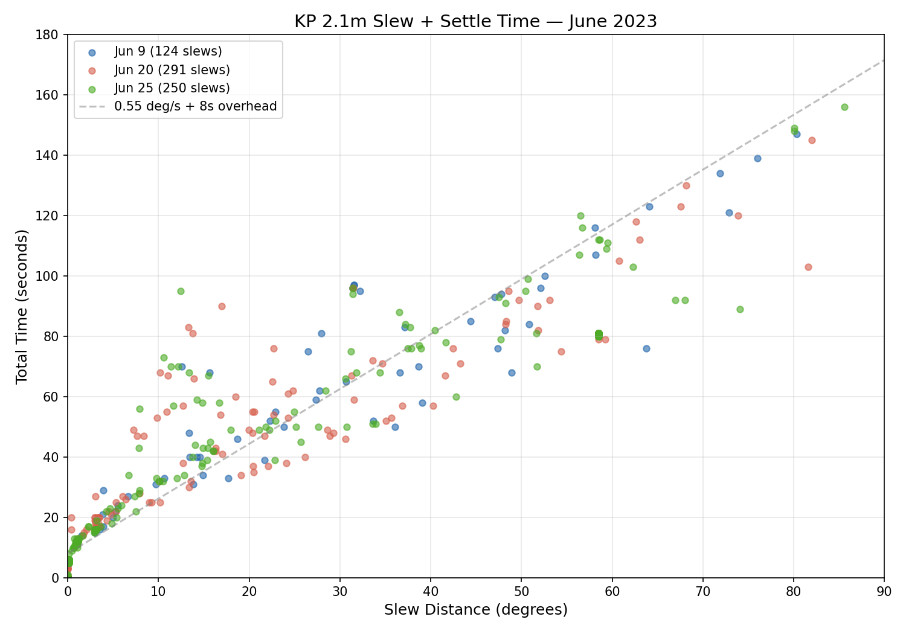

**Key observations:**

- The relationship between slew distance and total time is well-fit
  by a linear model: **T ≈ D / 0.55 + 8 seconds**, where D is the
  move distance in degrees. The 0.55 deg/s represents the effective
  slew velocity (including acceleration and deceleration), and the
  ~8s fixed overhead represents settling and convergence time.

- Performance is consistent across all three nights — the three
  colors interleave without systematic separation, indicating
  night-to-night reproducibility.

- Most points lie near or below the reference line. Points above it
  typically involve dome moves (the dome must also slew to track the
  telescope, adding time when the dome move is the longer leg) or
  multi-pass convergence (the pointing loop needs 2-3 iterations to
  reach the target).

- **Throughput implication:** A typical CSS follow-up dither of ~1°
  takes ~10s. A large slew of 60° takes ~120s. For a night with
  50 targets at 30° average separation and 4 dithers each, the slew
  budget is roughly 50 × (65s + 4 × 10s) ≈ 87 minutes — about 18%
  of a 8-hour night.

## Small slew overhead (0–2°)

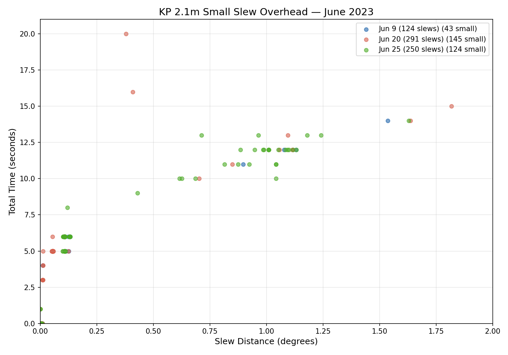

**Key observations:**

- Small slews (< 2°) show a quantized time structure due to the 1s
  timestamp resolution in the rtel logs. The minimum time for any
  move is effectively **3-5 seconds** for very small offsets (<0.1°).

- Moves of 0.5–1.2° consistently take **10-13 seconds**. This is the
  typical dither offset cadence — the time between exposures in a
  4-position dither pattern.

- The June 25 night (green) shows slightly faster small-slew
  performance than June 20 (red), possibly reflecting different
  target densities or sky positions.

- **CSS relevance:** The dither cadence of 10-13s per position means
  a 4-exposure dither set takes ~50s of slew time plus 4 × 5-10s
  exposure time = ~90-100s total per target visit. This matches
  the ~60s per NEXTPOS cycle observed in the CSS V06 control logs.

## Pointing residual distribution

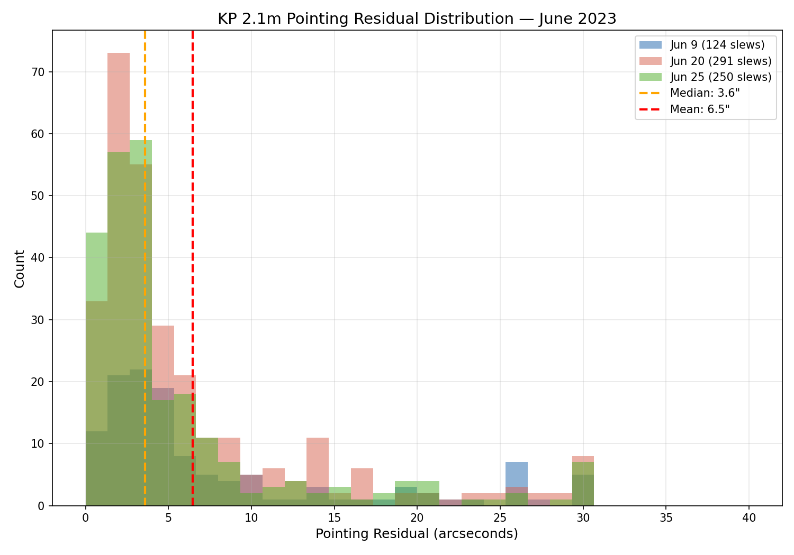

**Key observations:**

- The distribution is **bimodal**: a tight primary peak at **1-4
  arcseconds** (most slews) and a secondary population extending
  from 10" to 30"+.

- Combined median: **3.6"**, mean: **6.5"**. The median is the
  operationally relevant number — most slews achieve good pointing.

- The three nights show different tail characteristics:
  - Jun 9 (blue): a distinct cluster at 26-28" — possibly a
    systematic offset at specific sky positions
  - Jun 20 (red): a broader tail extending to 30" with a bump
    at 14-16" — the busiest night, more diverse sky coverage
  - Jun 25 (green): tightest distribution, fewest outliers

- **The bimodal structure suggests a correctable systematic:**
  The secondary peak at ~27" is suspiciously close to the HA
  backlash (170" between gear tooth faces = 2.8 arcmin). If the
  approach direction relative to the worm gear backlash is not
  consistently controlled by the overshoot parameter in point.C,
  some fraction of slews will land on the wrong side of the
  backlash gap.

- **CSS relevance:** For astrometric follow-up, 4" median blind
  pointing is excellent — well within the field of view of any
  reasonable camera. The tail population (>10") would require the
  target to be within the field but offset from center, which the
  CSS pipeline handles via plate solving. A refreshed pointing
  model would likely reduce the tail significantly.

## Implications for CSS operations at KP 2.1m

1. **The telescope can sustain 250-290 slews per night** on
   productive sessions (Jun 20 and 25). This is adequate for the
   50-100 target follow-up mode anticipated for CSS.

2. **Slew overhead is predictable:** T ≈ D/0.55 + 8s. This enables
   accurate scheduling and observing plan optimization.

3. **Dither cadence is ~10-13s** for the 0.5-1.2° offsets typical
   of a 4-position pattern. Combined with 5-10s exposures, a
   complete dither set takes ~90-100s.

4. **Blind pointing of 3.6" median** is adequate for CSS cameras
   (typical field >5 arcmin). The bimodal residual distribution
   warrants investigation — a new pointing model and verification
   of the overshoot parameter may eliminate the 27" secondary peak.

5. **Night-to-night consistency is good.** The three June 2023
   sessions show reproducible performance, suggesting the drive
   system is mechanically stable when properly maintained.

---

## Comparison: April 2024 (pre-runaway)

To check whether performance was stable through the telescope's
final active period, the same analysis was repeated for three
productive nights in April 2024 — just 11-17 days before the
April 28 runaway incident (encoder power supply failure).

| Date | Slews | Notes |
|------|-------|-------|
| 2024-04-11 | 180 | Full session |
| 2024-04-16 | 141 | Full session |
| 2024-04-17 | 170 | Full session |
| **Total** | **491** | |

### Slew + settle time (0–90°)

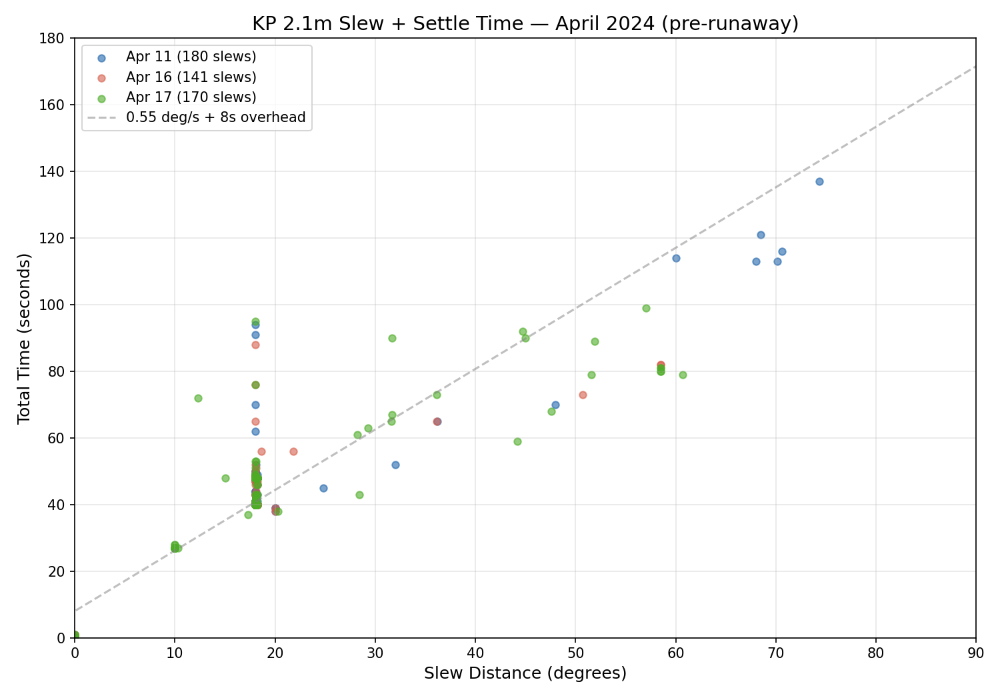

Performance is consistent with June 2023. The 0.55 deg/s + 8s
reference line still fits well. Most large slews cluster around
17-20° (a preferred target spacing) and 55-75° (cross-sky moves).
No degradation visible in the 10 months between these datasets.

### Small slew overhead (0–2°)

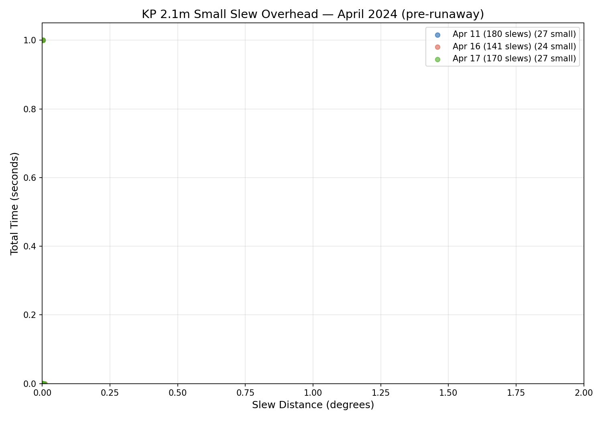

The April 2024 observing pattern is markedly different from June
2023: almost all small moves are near zero distance (sub-arcsecond
offsets) with 0-1s elapsed time. The degree-scale dithers seen in
June 2023 are largely absent. This suggests the previous team was
using a different observing strategy — possibly larger fields with
single pointings rather than multi-position dithers, or an
autoguider-based acquisition sequence that produces very small
corrections rather than deliberate offsets.

### Pointing residual distribution

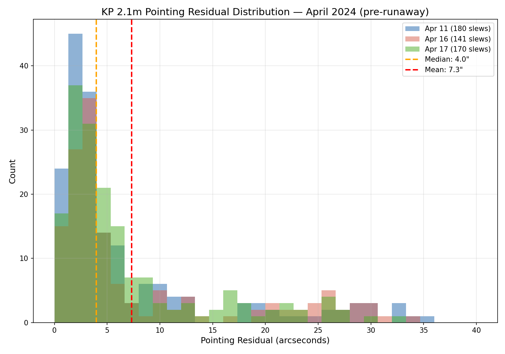

The residual distribution is very similar to June 2023: median
4.0", mean 7.3". The bimodal structure persists, with the same
secondary population at 15-35". The consistency across 10 months
and different sky coverage confirms this is a systematic feature
of the pointing model and drive system, not a transient condition.

### June 2023 vs. April 2024: summary

| Metric | Jun 2023 | Apr 2024 |
|--------|----------|----------|
| Nights | 3 | 3 |
| Total slews | 665 | 491 |
| Median residual | 3.6" | 4.0" |
| Mean residual | 6.5" | 7.3" |
| Slew rate model | 0.55 deg/s + 8s | 0.55 deg/s + 8s |
| Dither pattern | 0.5-1.2° offsets | Sub-arcsecond offsets |

**Conclusion:** The telescope's slew rate and pointing *accuracy*
were stable from June 2023 through April 2024. However, pointing
*convergence* degraded significantly — see below.

---

## October 2023: intermediate comparison

Three nights from the last consistent observing month.

| Date | Slews | Notes |
|------|-------|-------|
| 2023-10-03 | 24 | |
| 2023-10-04 | 27 | |
| 2023-10-13 | 28 | |
| **Total** | **79** | |

### Slew + settle time (0–90°)

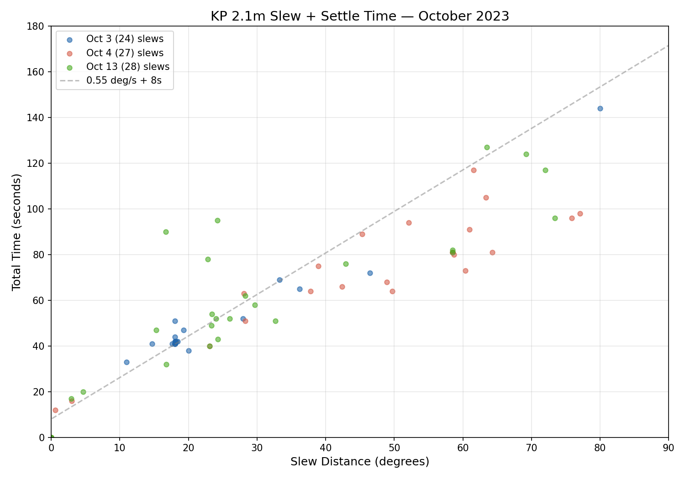

Consistent with June 2023. The 0.55 deg/s + 8s model fits well.

### Small slew overhead (0–2°)

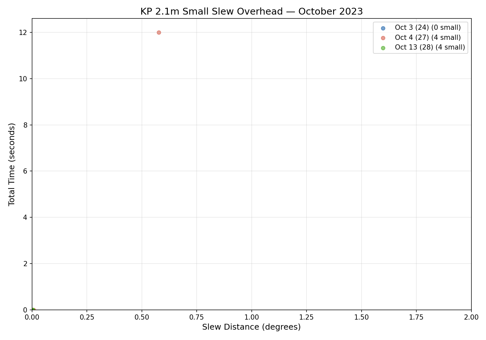

Very few small slews — mostly zero-distance re-points plus one
real 0.6° move at 12s. The observing pattern is target-to-target
without dithering.

### Pointing residual distribution

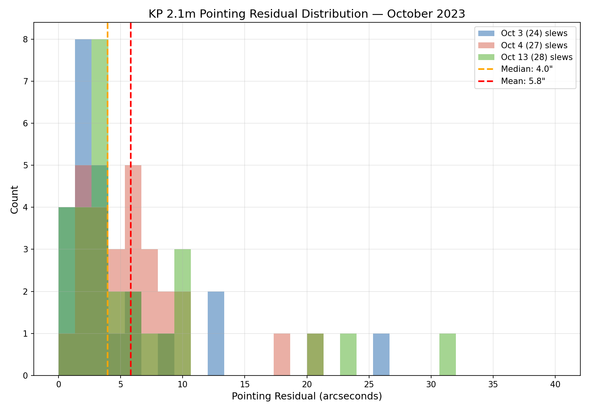

Median 4.0", mean 5.8" — slightly tighter than the other periods.
The bimodal tail is present but less prominent with this smaller
sample.

---

## Near-zero slews in April 2024

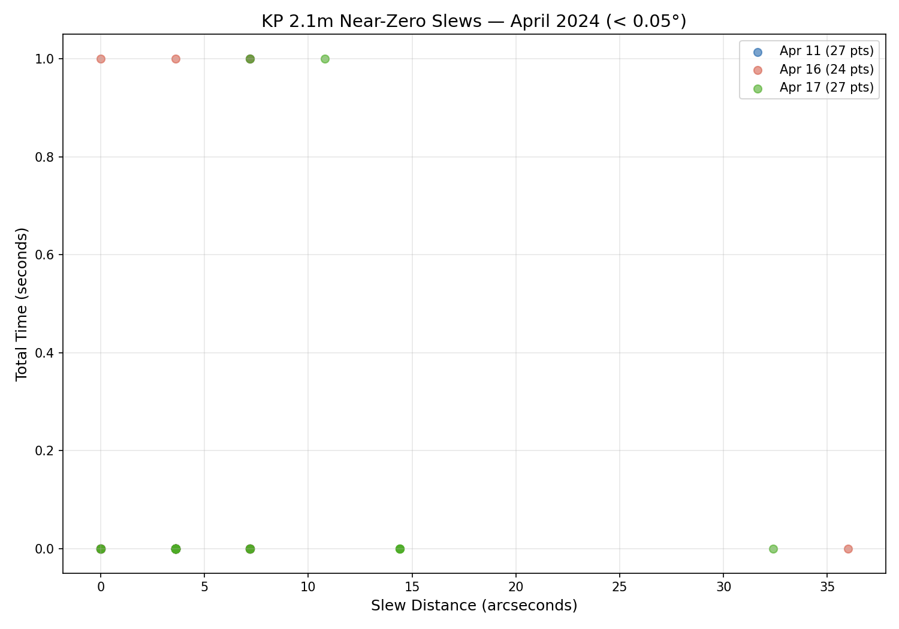

78 slews within 0.05° (180 arcsec): these are re-points where the
telescope was already at the target. The point command returns
immediately when the residual is below `maxdiff` (0.010°). Most
complete in 0 seconds; a few at 1 second reflect the timestamp
quantization. The scatter from 0" to 36" represents the natural
spread of "already there" positions.

---

## Convergence degradation: the full timeline

The most significant finding from this analysis is not in the
residuals or slew rates, but in the **multi-pass convergence rate**
— the fraction of slews requiring more than one iteration of the
pointing loop to reach the target.

The three-period comparison (June 2023 → October 2023 → April 2024)
suggested a gradual degradation. To test this, convergence statistics
were computed for **every date in the rtel archive with ≥20 real
slews** — 159 dates spanning November 2020 through April 2025.

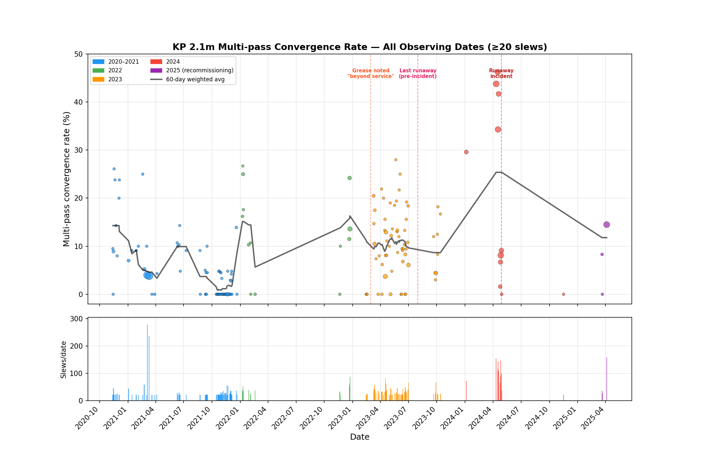

### Era summary

| Period | Dates | Slews | Multi-pass | Rate |
|--------|-------|-------|-----------|------|
| 2020–2021 | 71 | 2,258 | 107 | **4.7%** |
| 2022 | 13 | 531 | 75 | **14.1%** |
| 2023 H1 (Jan–Jun) | 52 | 1,655 | 174 | **10.5%** |
| 2023 H2 (Jul–Dec) | 9 | 308 | 25 | **8.1%** |
| 2024 pre-runaway (Apr 11–19) | 4 | 521 | 215 | **41.3%** |
| 2024 post-repair (Apr 24–29) | 5 | 437 | 28 | **6.4%** |
| 2025 (recommissioning) | 3 | 221 | 26 | **11.8%** |

### What the full timeline reveals

The three-period snapshot suggested monotonic degradation
(5% → 11% → 35%). The full timeline tells a more nuanced story:

1. **Baseline (2020–2021): 4.7%.** The telescope converged well
   during the Sells team's most active period. Most nights show
   0–5% multi-pass rates, with occasional spikes to 15–25%.

2. **January 2022 spike.** Four nights (Jan 8–11) show 17–27%
   multi-pass rates, then performance returns to baseline. This
   suggests a transient issue that was noticed and corrected —
   possibly a PMAC parameter adjustment or mechanical intervention.

3. **2023 is not monotonic.** The first half of 2023 averages 10.5%
   with considerable scatter (0% to 28% on individual nights),
   but the second half improves to 8.1%. This argues against a
   simple "grease getting worse" narrative — lubrication degradation
   would not reverse itself.

4. **April 2024 (Apr 11–19): 41.3% — dramatic and isolated.** This
   is not the endpoint of a gradual trend but a sudden jump. Four
   consecutive observing nights show 34–46% multi-pass rates,
   far outside the historical range. This occurred 11–17 days
   before the April 28 runaway incident.

5. **Post-repair recovery: 6.4%.** After the encoder power supply
   was repaired (Apr 24–29), convergence immediately returns to
   near-baseline levels. This is the strongest evidence in the
   dataset for identifying the root cause.

### Root cause: PMAC incremental encoder power supply

The convergence pattern — sudden onset, dramatic spike, immediate
recovery after repair — points to the **PMAC incremental encoder
power supply** as the primary cause, not lubrication or the
Raspberry Pi absolute encoder system.

The KP 2.1m has two independent encoder paths:

- **PMAC incremental encoders** (motor shafts): provide real-time
  feedback for the 2.45 kHz servo loop. An electrical short fed
  115V AC into these encoders' DC power supply on April 28,
  causing the catastrophic runaway. But degradation before complete
  failure — noisy or intermittent encoder signals from a failing
  power supply — would cause the servo to struggle to settle,
  producing exactly the multi-pass convergence pattern observed.

- **Raspberry Pi absolute encoders** (worm shafts, BEI 21-bit):
  read via GPIO and served over HTTP by a CGI script (`rabs`).
  Used by `point.C` to determine telescope position before
  commanding a slew. If the Pi returns a bad reading, the first
  slew goes to the wrong place — but subsequent passes also read
  the Pi, so intermittent Pi errors would produce *occasional*
  convergence failures, not the sustained 41% rate seen in
  April 2024. The Pi is also not implicated by the post-repair
  recovery, since the Pi was not part of the April repair.

The post-repair drop from 41.3% to 6.4% is dispositive: the same
hardware fix that prevented future runaways also restored
convergence performance. The encoder power supply was degrading
for at least 2–3 weeks before it failed completely.

### Implications

- **Multi-pass convergence rate is a precursor metric.** A rising
  rate indicates servo-level hardware issues before they become
  catastrophic. For CSS operations, this should be monitored
  automatically — an alert at >15% sustained would have flagged
  the April 2024 failure weeks in advance.

- **The 2022 and 2023 scatter** (occasional 15–25% nights within
  otherwise healthy periods) may reflect other transient
  conditions: wind loading, thermal gradients, or the known
  lubrication issues. These are operationally tolerable but
  worth correlating with environmental data when available.

- **The Raspberry Pi** is not implicated by this specific
  convergence pattern, but remains a reliability concern for
  other reasons (setuid CGI, no reading validation, SD card
  wear, deprecated wiringPi library — see `raspberry-pi-encoder.md`).

---

## Three-period comparison summary

| Metric | Jun 2023 | Oct 2023 | Apr 2024 |
|--------|----------|----------|----------|
| Nights | 3 | 3 | 3 |
| Total slews | 665 | 79 | 491 |
| Median residual | 3.6" | 4.0" | 4.0" |
| Mean residual | 6.5" | 5.8" | 7.3" |
| Slew rate model | 0.55+8s | 0.55+8s | 0.55+8s |
| Multi-pass rate | 5% | 11% | **35%** |
| Dither pattern | 0.5-1.2° | target-to-target | sub-arcsec |
| Days before runaway | 323 | 207 | 11-17 |
